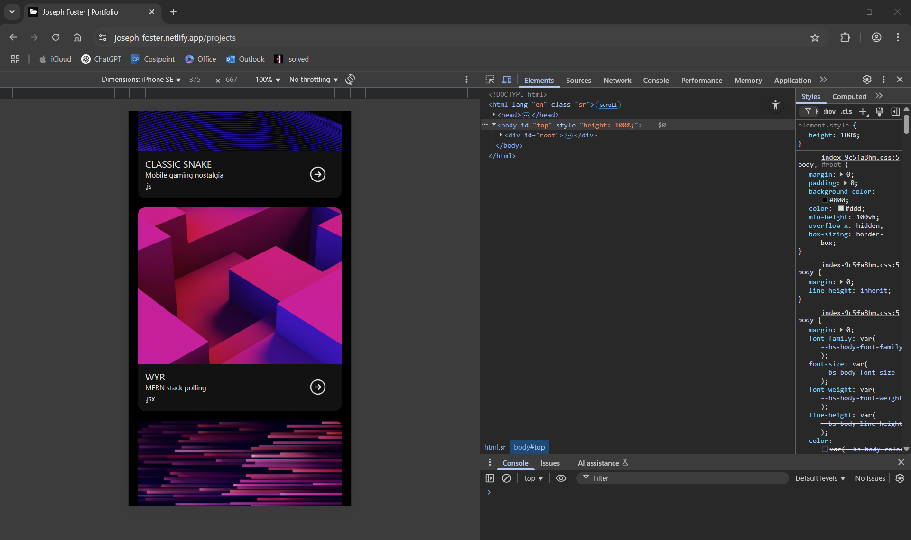

# Dynamic Portfolio

## Description

- Web-based portfolio using React, HTML, CSS, JavaScript and more!

  ## Table of Contents

  - [Installation](#installation)
  - [Usage](#usage)
  - [Contributing](#contributing)
  - [Questions](#questions)
  - [Link](#link-to-site)

  ## Installation

  - bootstrap
  - react
  - vite

  ## Usage

  - Available on Netlify. See link below.

  ## Contributing

  - Contribution unavailable at this time.

  ## Questions

  - Please email questions to joseph.s.foster@icloud.com.
  
  - For additional works, please visit [https://github.com/joseph-s-foster]

  ## Link to site

  - https://stunning-fox-4500e5.netlify.app

  ## Screenshot

  
